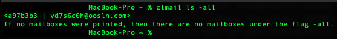
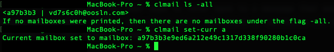
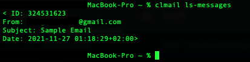
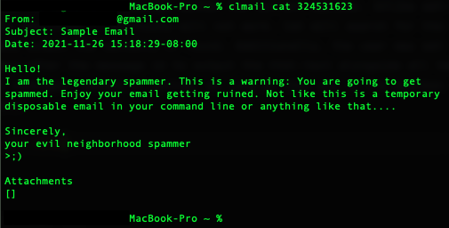
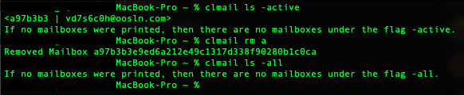
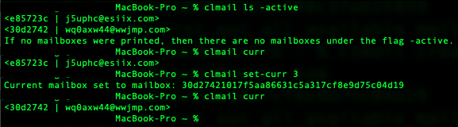

#CLTOOLS
## About
CLTools provides various tools and command to use in the terminal.
As of date, CLTools is only able to generate temporary email
addresses and receive emails. There are plans to integrate more
tools and options in the future.

CLTools allows for the user to easily generate new emails on the fly
to increase privacy, combat spam, and browse the internet in a safer
manner. Documentation on the commands can be found below. Additionally,
there are screenshots and gifs provided to visually understand how CLTools
works.

## Continuing Development
CLTools is an ongoing project with the intent of being forked and
modified. If you wish to contribute or continue development, you are
encouraged to fork the repository and continue development as you see
fit. All dependencies are listed below and are included in the virtual
environment. 

Please read the CLTools Design document as that contains information
about everything in the project to get you up to speed. If you run into
an error, feel free to create an issue or resolve it on your own.

## Dependencies and Tools
CLTools was made with the help of the following libraries and modules:
1. Python 3.9 - CLTools was developed in Python 3.9 so any version of
Python before 3.9 may be unsupported.
2. onesecmail by yyyyyyan -- CLTools uses the onesecmail library wrapper
developed by yyyyyyan.
3. pickle -- CLTools uses the pickle library to serialize data for
persistence.
4. hashlib -- CLTools uses the Hashlib library to SHA1 encode various data
5. lzma -- CLTools uses the LZMA library to pack all stored files on the
hard drive with the exceptions of attachments that are downloaded.

## Installation and Usage
CLTools is compiled with PyInstaller so python is not needed to run clmail. Simply
installing the binary in a directory known in your computer's PATH variable, will
allow you to run clmail from any directory at any time.
If not, you can store the binary where you see fit, cd to that
directory and run the command: 
    
    ./clmail [command here]

If you have the binary saved in a directory pointed to in your computer's PATH
variable, you can run the program by simply opening your terminal and typing:

    clmail [command here]

### Commands
#### create
    clmail create
create generates a new temporary email address. If this is the first or only existing
email address generated, then the address returned by create will automatically become
the current email address to which you can interact with. To change the current mailbox
or email address, you can use the set-curr command (Scroll down for more information.)

#### ls
    clmail ls [-all | -active | -cached]
In the spirit of open source, commands are based off of the linux filesystem. LS will
output all email addresses/mailboxes of the specified type. There are three type
specifications:
1. -all : Returns all email addresses/mailboxes that have been created and not deleted
2. -active: Returns all active email addresses/mailboxes that have been created and never
deleted. Active mailboxes will have their messages fetched from the server.
3. -cached: Returns all cached or inactive email addresses/mailboxes that have never been
deleted. Cached email addresses will never have their messages be fetched by the server due
to the high probability that such email addresses no longer exist. Consequently, any emails
received once said email addresses are cached will not be accessible from CLTools.

Cached email addresses are kept should the user need to refer back to a message that would
otherwise be no longer retrievable. Active and cached email addresses or mailboxes can be
deleted with the rm command. (See below for details.)

#### set-curr
    clmail set-curr [ID OF MAILBOX]
Because certain commands only operate with respect to the current mailbox (ls-messages, cat, pull, curr),
it is useful to be able to switch between the current mailbox. The ID of the mailbox passed it is the ID
shown by the ls command. Just like Git, you do not need to enter in the whole ID but just the first few
characters that are enough to distinguish the ID. If there are two ID with the first same set of characters
that you enter, one of the two will be selected according to Python's internal iterator implementation.
set-curr enables the user to switch between all mailboxes, cached or active.

#### ls-messages
    clmail ls-messages
ls-messages will list out all received emails in the current mailbox. The user will be given information
regarding the message id, subject, date, and sender. From this command, the user may select a specific
message from its message id.

#### cat
    clmail cat [MESSAGE-ID] (-v OPTIONAL)
cat will output the contents of a message within the current mailbox. Unlike set-curr, the ID of the message
must be completely specified -- shortcuts will not work. Cat will search for the message by its ID in the
current mailbox and output the contents if found. Additionally, the user may set the verbose flag by appending
'-v' to the command after the message id to output the html-text alongside all text embedded within the email.
Cat works for all messages, cached or active, as long as they are in the mailbox and are visible from the
ls-messages command.

#### pull
    clmail pull [MESSAGE-ID]
pull will download all attachments within the specified message. Like cat, the full message id must be specified.
This command should rarely be used since all attachments of messages are downloaded automatically. All
attachments can be found at the source directory of this program in the Downloads folder. The Downloads
directory is organized as follows:
    
    Downloads/
        EmailID+EmailAddress/
            Attachment1
            Attachment2

#### rm
    clmail rm [MAILBOX-ID]
rm is a destructive command. rm will remove all mailbox data specified by the mailbox id if the mailbox
exists. Like set-curr, the ID can be truncated so that only a few characters are needed to determine a
unique mailbox. rm will remove all downloaded attachments, all messages, and clear up all data related
to the mailbox specified. rm will delete all mailboxes, cached or active. Use with caution.

#### curr
    clmail curr
curr will simply output the current mailbox. The user will be given the mailbox id and address.

